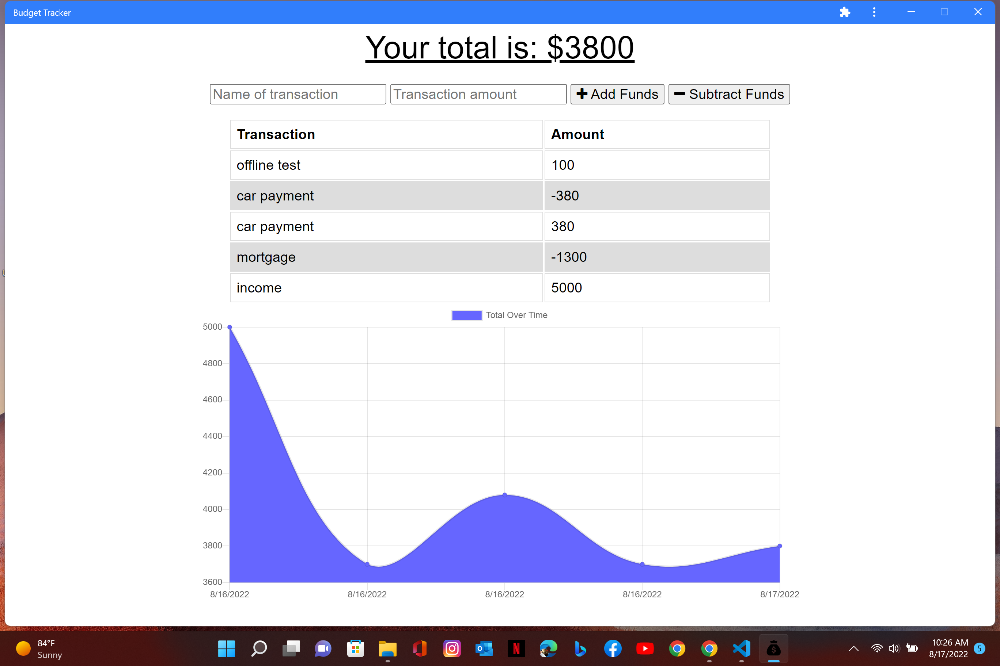

  # PWA Budget Tracker
  
  ## Link to Deployed Application

  -[Visit Budget Tracker-->](https://brads-pwa-budget-tracker.herokuapp.com/)

  ## Link to Repository

  -[Visit Repo-->](https://github.com/Codechef27/pwa-budget-tracker)

  ## Table of Contents

  - [Description](#description)
  - [Installation](#install-instructions)
  - [Languages](#languages-used)
  - [Usage](#usage)
  - [Contribution](#contributing)
  - [Questions](#questions)

  ## Description

  This app allows a user to download the application, add & subtract budget data and allows budget updates while offline.

  ## Technology Used

  1. HTML 
  2. CSS 
  3. Javascript 
  4. indexeddb
  5. MongoDB
  6. service-worker

  ## Usage 

  This application allows for a user to keep track of a budget.

  ## Install Instructions

  Visit the link to the deployed application then click the install icon located at the right side of url.

  ## Contributing

  Bradley J Kennett

  ## Questions

  Contact Me!

  * Github Account:  [Codechef27](https://github.com/Codechef27)
  * Email Me:  bradleyjkennett@gmail.com
  
  ## Screenshot

  